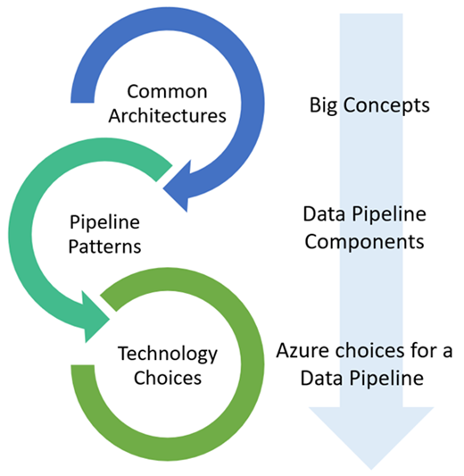
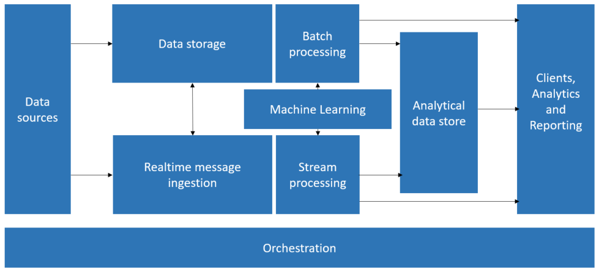

# Azure Data Architecture Guide

This guide presents a structured approach for designing data-centric solutions on Azure. It is based on proven practices that we have learned from customer engagements and is intended as an entry point for all data related topics in Azure. The guide covers the big picture concepts in common data architectures, which lead you to the pipeline patterns used by that architecture. The pipeline patterns are used to describe how the various processing and storage components fit together in handling the data. Finally, the technology choices will help you narrow the list of candidate Azure services appropriate to your pipeline pattern down to those services that are most appropriate to your specific requirements. 

# Introduction
The cloud is changing the way applications are designed, including how data is processed and stored. Instead of a single general-purpose database that handles all of a solution's data, the modern approach is to use multiple, specialized databases and datastores- each optimized to provide specific capabilities needed by the solution. This approach is called polyglot persistence. The perspective on data in the solution changes as a result. It is no longer the case that there are multiple layers of business logic and a single data layer. Instead modern, polyglot persistence solutions are designed around the notion of a data pipeline which describe how data flows through a solution, where it is processed, where it is stored and how its consumed by the next component in the pipeline. 

Owing to the fundamental importance of the data pipeline throughout modern data architectures, this guide demonstrates all data pipelines as variants of the following canonical data pipeline:  

# How this guide is structured
This guide is structured so that your entry point to the content can be at the level of the common architecture, the pipeline pattern or the technology choices for a particular pipeline scenario. 

At the end of each article is provided a Read Next link which you can follow to take a linear path thru the content. In addition, links to alternate and related content are provided to guide you to related content that provides you a perspective on the options, as well as provides links back up to the related parent topics and links to drill down into further detail.

## Where to go from here
Read Next:
[Common Data Architectures](./common-architectures/overview.md)

See Also:

Alternative Common Architectures
- [Non-Relational Data](./common-architectures/non-relational-data.md)
- [Big Data](./common-architectures/big-data.md)

Related Common Architectures
- [Relational Data](./common-architectures/relational-data.md)
- [Advanced Analytics](./common-architectures/advanced-analytics.md)
- [Data Pipeline](./common-architectures/data-pipeline.md)
- [Semantic Modeling](./common-architectures/semantic-modeling.md)
